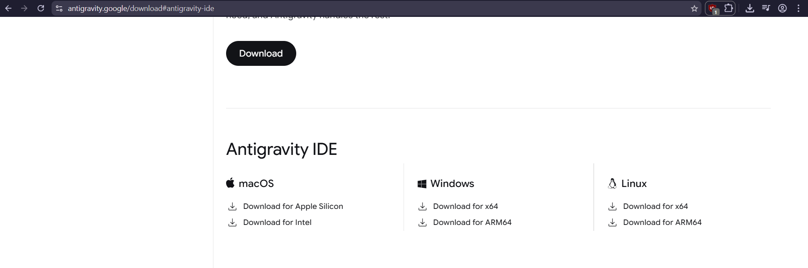
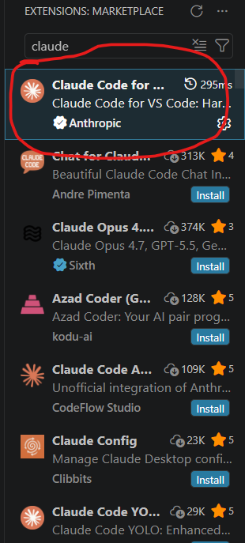
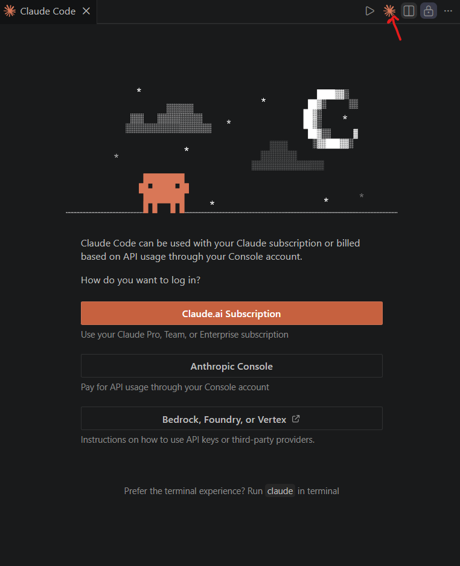
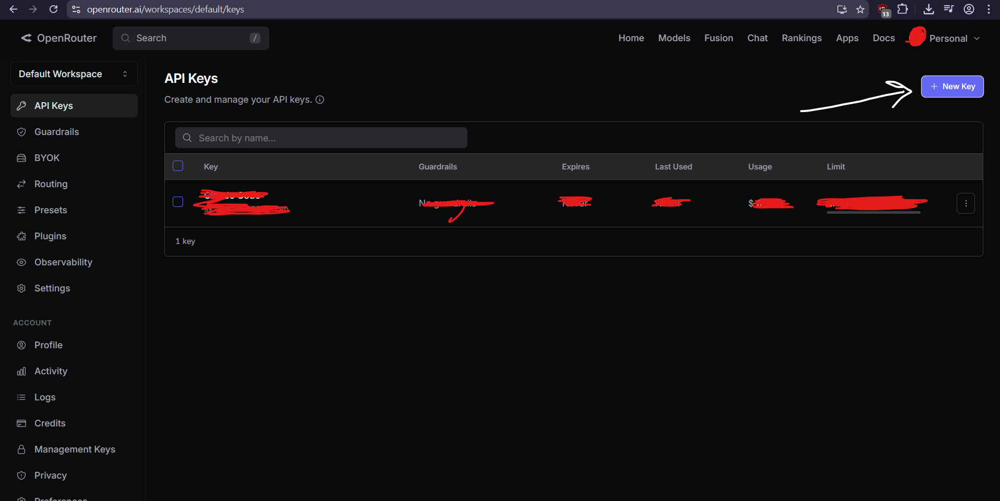
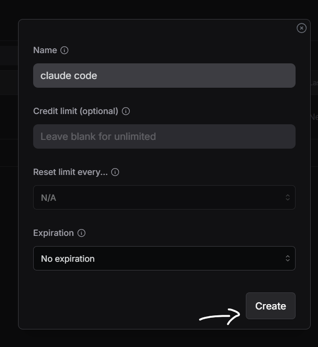
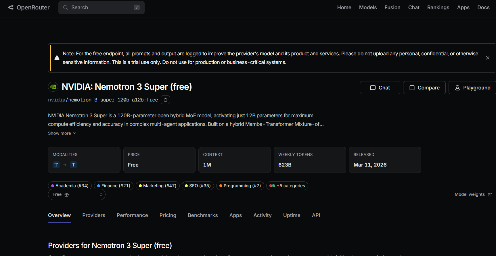
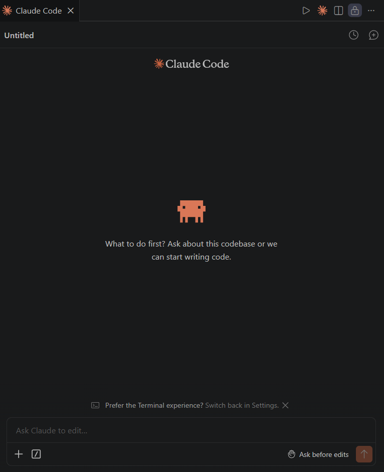
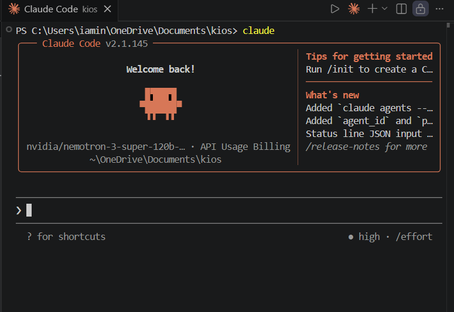

# please-dont-sue-me-anthropic

> “Because $200/month sounded like a skill issue.”

Run Claude Code inside Anti Gravity IDE using OpenRouter, multi-agent workflows, and cheaper/free AI models to build your own chaotic AI dev team.

---

# ⚠️ IMPORTANT

## AntiGravity 2.0 Warning

Due to AntiGravity 2.0 changes, this method may not fully work exactly the same currently.

You can still download and use AntiGravity IDE separately from their official website (which is honestly better anyways).

👉 Official Website:  
https://antigravity.google/download#antigravity-ide

---

# 🧠 What This Repo Does

This setup allows you to:

- Use Claude Code with OpenRouter
- Route Claude requests to FREE models
- Use Claude Code without paying Anthropic API pricing
- Use models like:
  - Gemini
  - DeepSeek
  - Nemotron
  - OpenAI
  - Qwen
  - etc.

And the best part:

After setup, Claude Code works globally.

Meaning you can use it in:
- Terminal
- VSCode
- Cursor
- Windsurf
- Anti Gravity
- basically anywhere

No need to setup again.

---

# 📦 Step 1 — Download AntiGravity IDE

Download AntiGravity IDE from:

https://antigravity.google/download#antigravity-ide

## Screenshot

<p align="center">
  
</p>

---

# 📥 Step 2 — Install Claude Code

## Option A (Recommended)

Install the official Claude Code extension from marketplace.

⚠️ Make sure it's the OFFICIAL extension by Anthropic.

## Screenshot

<p align="center">
  
</p>

---

## Option B (Terminal Install)

You can directly install Claude Code from terminal:

```powershell
irm https://claude.ai/install.ps1 | iex
```

Terminal goblins can skip the extension install entirely.

---

# 🚀 Step 3 — Open Claude Code

Click the Claude icon.

You should see something like this:

<p align="center">
  
</p>

If you see this screen, you're chilling.

DO NOT login yet.  
Just leave it for now.

---

# 🤖 Step 4 — Give AntiGravity The Prompt

This repo includes a setup prompt file:

```txt
Prompt.md
```

Paste the prompt into Anti Gravity  
OR directly give the `Prompt.md` file to the agent and tell it:

> execute this

The prompt automatically:
- configures Claude Code
- routes it through OpenRouter
- sets environment variables
- prevents common setup mistakes
- configures global Claude access

---

# 🧘 Step 5 — Let Bro Cook

Now wait for the agent to finish.

Seriously.

Do not interrupt it halfway like a maniac.

Allow the actions it asks for and let it do its thing.

This is the part where:
- configs get generated
- Claude gets patched
- routing gets setup
- environment variables get configured
- everything magically starts working

My man. Chill.

---

# 🔑 Step 6 — Create OpenRouter API Key

Go to:

https://openrouter.ai/workspaces/default/keys

Create a new API key.

⚠️ IMPORTANT:
Copy the key IMMEDIATELY after creating it.

## Screenshot

<p align="center">
  
</p>

---

## Create The Key

You can name it anything.

Example:
- claude code

Then click Create.

## Screenshot

<p align="center">
  
</p>

---

# 🧠 Step 7 — Choose A Free Model

Go to OpenRouter models section.

Pick any FREE model.

I personally use:

```txt
NVIDIA: Nemotron 3 Super (free)
```

Model ID:

```txt
nvidia/nemotron-3-super-120b-a12b:free
```

## Screenshot

<p align="center">
  
</p>

---

# 📋 Step 8 — Paste The Key + Model

After the FIRST prompt finishes successfully:

Paste:
- your OpenRouter API key
- your model ID

into Anti Gravity.

Then execute it.

And once again...

WAIT.

Let bro finish cooking.

---

# 🔄 Step 9 — Restart Everything

Restart your IDE completely.

Then open Claude Code again.

Now it should work correctly.

---

# ✅ Step 10 — Verify It Works

Open terminal and run:

```bash
claude
```

If you see:
- Claude Code starting normally
- your selected OpenRouter model
- no Anthropic login errors

Congratulations.

You survived.

## Screenshot

<p align="center">
  
</p>

---

# 🌍 Claude Code Now Works Everywhere

Your setup is now GLOBAL.

You can use Claude Code in:
- terminal
- VSCode
- Cursor
- Windsurf
- AntiGravity
- basically any IDE

No setup required again.

---

# 🧪 Example Models

Some good free models:

| Model | ID |
|---|---|
| Nemotron 3 Super | `nvidia/nemotron-3-super-120b-a12b:free` |
| DeepSeek | `deepseek/deepseek-chat-v3-0324:free` |
| Gemini | `google/gemini-2.5-pro-exp-03-25:free` |

---

# ⚠️ Common Errors

## "Model not found"

Your model ID is wrong.

Copy the EXACT model ID from OpenRouter.

---

## Claude Still Asks For Login

Restart:
- terminal
- IDE
- Claude session

Completely.

---

## 429 Errors

Free models have rate limits.

Wait a minute and retry.

---

# 🧠 Multiple Models Setup (Optional)

You are NOT limited to one model.

Claude Code can route through multiple OpenRouter models if you want.

Just tell Anti Gravity something like:

> "I want to add multiple models support"

Then:
- create more OpenRouter API keys if needed
- pick additional models
- paste them into Anti Gravity
- let the agent configure the routing

You can mix:
- Gemini
- DeepSeek
- Nemotron
- Claude
- OpenAI
- Qwen
- etc.

This lets you build:
- coding agents
- planning agents
- debugging agents
- frontend agents
- backend agents

basically your own AI dev team.

---

# 🖥️ Final Verification

Open terminal and run:

```bash
claude
```

If you see your selected OpenRouter model inside Claude Code startup:

YOU DID IT.

## Screenshot

<p align="center">
  
</p>

Claude Code is now:
- globally configured
- routed through OpenRouter
- working in terminal
- ready inside any IDE

student budget engineering achieved.

---

# 🧠 Why This Works

Claude Code normally talks directly to Anthropic.

This setup redirects Claude Code through OpenRouter instead.

OpenRouter supports Anthropic-compatible APIs.

Meaning:
Claude Code thinks it's talking to Anthropic...

but it's actually talking to:
- Gemini
- DeepSeek
- Nemotron
- Qwen
- etc.

engineering moment.

---

# 📂 Included Files

```txt
Prompt.md
README.md
```

---

# 🙏 Final Notes

This repo is for:
- learning
- experimentation
- AI workflows
- development

Please do not abuse free endpoints.

And maybe don't upload your nuclear launch codes to free models.

---

# ⭐ Star The Repo

If this repo saved your wallet:
drop a star.

your GPU died for this.

---
